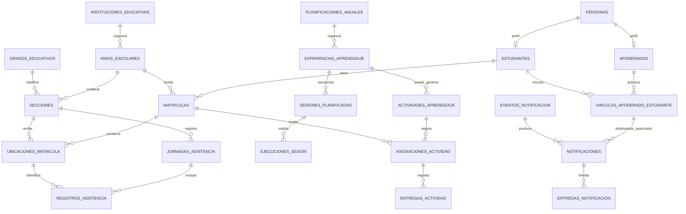

# Modelo de datos — EduFast

> **Fuente de verdad del esquema:** migraciones SQL de `supabase/migrations/`. Los nombres físicos de tablas y columnas están en español, `snake_case` y sin tildes. El código Java conserva nombres en inglés y mapea las entidades a esos nombres.

## Alcance

Este esquema contempla la primera entrega de asistencia, matrícula anual, apoderados, notificaciones y seguimiento básico de actividades. También deja modeladas las relaciones curriculares necesarias para vincular unidades/sesiones futuras sin matricular estudiantes en cursos.

La app/web nunca accede directamente a la base: ambos clientes usan la API Spring. Las claves privadas de PostgreSQL y de proveedores push no se distribuyen a los clientes.

## Relaciones principales

## Catálogo de tablas por migración

### `20260928000100_base_escolar.sql`

Institución y trayectoria:

- `instituciones_educativas`, `sedes_educativas`, `anios_escolares`
- `niveles_educativos`, `ciclos_educativos`, `grados_educativos`, `turnos`
- `secciones`, `aulas`
- `personas`, `cuentas_usuario`, `roles`, `asignaciones_roles`
- `estudiantes`, `apoderados`, `contactos_persona`, `vinculos_apoderado_estudiante`
- `matriculas`, `ubicaciones_matricula`, `movimientos_matricula`
- `asignaciones_docentes`
- `jornadas_asistencia`, `registros_asistencia`

Reglas relevantes:

- Una matrícula corresponde a un estudiante, institución y año escolar.
- `ubicaciones_matricula` conserva el historial de grado/sección; un índice único parcial permite una sola ubicación vigente por matrícula.
- La matrícula, la sección y la ubicación usan claves foráneas simples; la coherencia de año escolar se valida en la aplicación.
- La capacidad de una sección no fija su cantidad de matriculados. La semilla usa 18 por sección, pero el esquema no impone ese número.
- Una pasada de lista es única por sección/fecha; cada detalle corresponde a una ubicación de matrícula.
- Un cambio de sección no elimina la asistencia histórica.

### `20260928000200_curriculo_planificacion.sql`

Currículo y planificación pedagógica:

- `versiones_curriculares`, `areas_curriculares`, `competencias`, `areas_competencias`
- `capacidades`, `estandares_aprendizaje`, `desempenos_grado`, `planes_estudio`, `planes_estudio_areas`
- `ofertas_curriculares`
- `periodos_evaluacion`, `eventos_calendario`
- `planificaciones_anuales`, `destinos_planificacion`
- `experiencias_aprendizaje`, `experiencias_competencias`, `experiencias_periodos`, `criterios_evaluacion`
- `instrumentos_evaluacion`, `criterios_instrumento`, `niveles_instrumento`
- `sesiones_planificadas`, `sesiones_competencias`, `actividades_sesion`, `evidencias_previstas`
- `ejecuciones_sesion`, `evidencias_aprendizaje`, `valoraciones_evidencia`, `retroalimentaciones`
- `progreso_competencias`
- `horarios_seccion`

Una experiencia puede ser unidad, proyecto, experiencia o módulo. Puede integrar varias áreas/competencias y dirigirse a varias secciones. Una experiencia puede abarcar uno o varios períodos de evaluación y viceversa (`experiencias_periodos`). Las sesiones tienen orden pedagógico separado de la fecha de ejecución. La relación unidad-sesión puede ser nula para una actividad independiente, por ejemplo, una evaluación diagnóstica o un refuerzo. El horario semanal previsto de cada sección vive en `horarios_seccion`; la ejecución real de una sesión se registra por separado en `ejecuciones_sesion`.

### `20260928000300_actividades_notificaciones.sql`

Actividades y comunicación:

- `actividades_aprendizaje`, `destinos_actividad`, `asignaciones_actividad`
- `entregas_actividad`, `archivos`, `revisiones_actividad`
- `tipos_notificacion`, `preferencias_notificacion`, `dispositivos_notificacion`
- `eventos_notificacion`, `notificaciones`, `entregas_notificacion`, `intentos_notificacion`
- `eventos_auditoria`

El registro de “no entregada” solo se crea al ser confirmado por un actor autorizado; no se infiere por ausencia de archivo. El evento de notificación es idempotente y puede producir distintas entregas por destinatario/dispositivo.

### `20260928000400_roles_y_alcances_personal.sql`

- Agrega el rol de acceso `SECRETARIA`.
- `asignaciones_roles.nivel_educativo_id` delimita asignaciones de dirección por nivel; `NULL` representa alcance institucional.
- `asignaciones_roles.reporta_a_cuenta_usuario_id` registra la relación de supervisión de una asignación, por ejemplo, una secretaria que reporta a la dirección general.
- `asignaciones_docentes.funcion` distingue a un docente regular de un auxiliar. Ambos usan el rol de acceso `DOCENTE`.
- Habilita `pgcrypto` para que el generador de datos de desarrollo convierta la contraseña configurada en un hash BCrypt sin guardarla en los archivos del repositorio.

## Restricciones críticas

- `UNIQUE(institucion_id, anio_escolar_id, grado_id, nombre)` en secciones.
- `UNIQUE(estudiante_id, anio_escolar_id)` en matrículas de la IE.
- Una única ubicación vigente por matrícula.
- `UNIQUE(seccion_id, fecha)` en jornadas de asistencia.
- `UNIQUE(jornada_id, ubicacion_matricula_id)` en detalle de asistencia.
- `UNIQUE(experiencia_id, numero_orden)` en sesiones planificadas.
- `UNIQUE(seccion_id, dia_semana, hora_inicio)` en horarios de sección.
- `UNIQUE(evento_id, vinculo_apoderado_estudiante_id)` en avisos al destinatario.
- `UNIQUE(clave_idempotencia)` en eventos de notificación, para evitar avisos duplicados en reintentos.
- Las valoraciones académicas guardan competencia/período/nivel; no se promedian letras automáticamente.

## Supabase, seguridad y migraciones

- Aplicar migraciones con Supabase CLI (`supabase db push`), después de enlazar el proyecto local al proyecto Supabase.
- Ejecutar `supabase/seed.sql` solo en desarrollo. El generador crea 2 secciones por grado y una cantidad configurable de estudiantes por sección (10 por defecto); genera una relación de apoderado para cada estudiante y agrupa hermanos mediante el parámetro `EDUFAST_DEMO_SIBLING_PAIRS`. Crea cuentas sintéticas solo para personal adulto y apoderados, nunca para estudiantes. Los correos de prueba usan `EDUFAST_DEMO_EMAIL_DOMAIN` y el hash de contraseña se deriva de `EDUFAST_DEMO_PASSWORD`, ambos definidos localmente en `backend/.env`. Las notificaciones de las relaciones demo quedan desactivadas mientras sus contactos ficticios no estén verificados.
- La semilla dinámica no se ejecuta automáticamente desde Supabase CLI. En local, usa `supabase db reset` y luego ejecútala con `psql` contra el puerto local configurado. En un proyecto remoto de desarrollo, despliega primero las migraciones con `supabase db push` y ejecuta luego la semilla con `psql` usando la URI `SUPABASE_DB_URL`. No ejecutes la semilla en producción.
- La clave de conexión solo vive en variables de entorno del backend. No agregar `service_role`, contraseña ni JWT secreto al repositorio.
- El backend se conecta con un rol de servicio que ignora RLS (equivalente al usuario `postgres` o `service_role` de Supabase, o a un rol local con `BYPASSRLS`). Las políticas RLS están pensadas para bloquear el acceso directo de clientes (`anon`/`authenticated`); el backend nunca publica credenciales a web/móvil.
- Las entidades JPA mapean estas tablas y Hibernate valida el esquema al arrancar (`ddl-auto=validate`); las migraciones son la única fuente de verdad de la estructura.

## Compatibilidad con SIAGIE

SIAGIE se trata como sistema externo de referencia. Los códigos externos se guardan en campos explícitos o en una futura tabla de correspondencias; no se duplica la aplicación ni se asume una API de integración no confirmada.

## Referencias oficiales usadas para el modelo

- [Disposiciones que regulan el proceso de matrícula en Educación Básica, RM N.° 010-2026-MINEDU](https://repositorio.minedu.gob.pe/handle/20.500.12799/11849): trayectoria/FUM, matrícula, secciones y traslados.
- [Currículo Nacional de la Educación Básica](https://www.minedu.gob.pe/curriculo/pdf/curriculo-nacional-de-la-educacion-basica.pdf) y programas curriculares de [Primaria](https://repositorio.minedu.gob.pe/handle/20.500.12799/4549) y [Secundaria](https://repositorio.minedu.gob.pe/handle/20.500.12799/4550): niveles, ciclos, grados, áreas y competencias.
- [Orientaciones de planificación, mediación y evaluación en Secundaria](https://repositorio.minedu.gob.pe/bitstream/handle/20.500.12799/6646/Planificaci%c3%b3n%2c%20mediaci%c3%b3n%20y%20evaluaci%c3%b3n%20de%20los%20aprendizajes%20en%20la%20Educaci%c3%b3n%20Secundaria.pdf?isAllowed=y&sequence=1): planificación flexible, criterios, evidencias y retroalimentación.
- [Planificación curricular en Primaria](https://repositorio.minedu.gob.pe/handle/20.500.12799/5310) y [sesiones multigrado](https://repositorio.minedu.gob.pe/handle/20.500.12799/10342): organización de anual → experiencia/unidad → sesiones y adaptación al contexto.
- [RVM N.° 094-2020-MINEDU](https://www.gob.pe/institucion/minedu/normas-legales/541161-094-2020-minedu), modificada por [RVM N.° 048-2024-MINEDU](https://www.gob.pe/institucion/minedu/normas-legales/5518274-048-2024-minedu): valoración por competencias, niveles de logro y conclusiones descriptivas.
